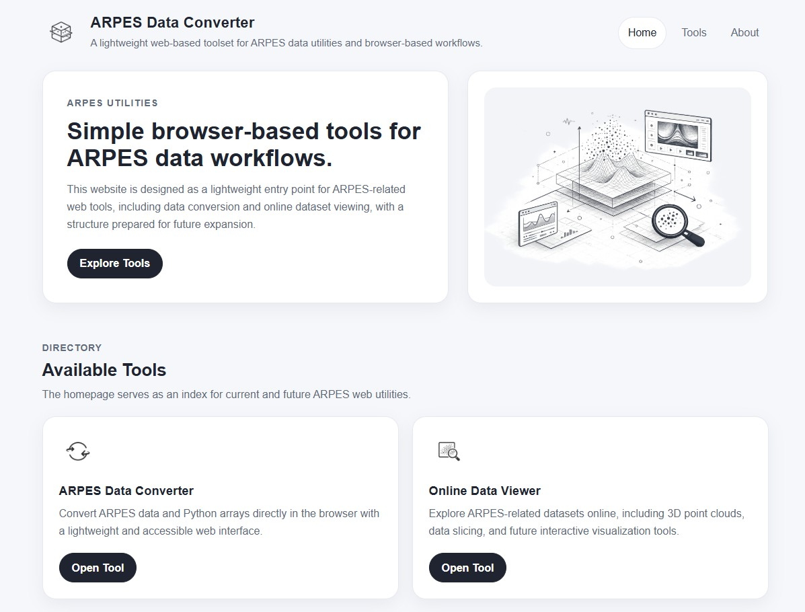
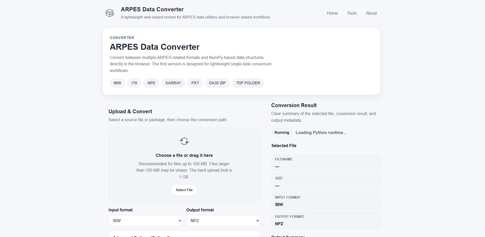

# ARPES Converter

A lightweight, browser-based tool for ARPES data format conversion.

This project was developed as a personal practice project for web interface design and scientific data handling.

If any content is found to infringe intellectual property rights, please contact me and it will be removed promptly.

---

## Web

Live Demo: https://chordc.github.io/arpes-converter-web/

---

## Features

* `.ibw` → `.npz`
* `.itx` → `.npz`
* `.pxt` → `.npz`
* `.zip` → `.npz`
* `.npz` → `.nc` (xarray)

---

## Notes

* Recommended file size: ≤ 100 MB
* Hard limit: ≤ 1 GB
* Large files may be slower due to browser memory limits

---

## Third-Party Libraries

* Pyodide — https://pyodide.org/
* NumPy — https://numpy.org/
* xarray — https://docs.xarray.dev/

---

## License

MIT License
